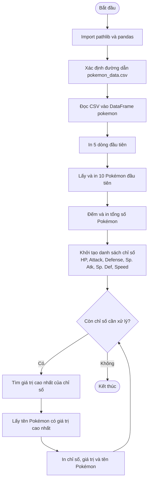

# Sơ đồ chương trình thống kê Pokémon

```mermaid
flowchart TD
    A([Bắt đầu]) --> B[Import pathlib và pandas]
    B --> C[Xác định đường dẫn pokemon_data.csv]
    C --> D[Đọc CSV vào DataFrame pokemon]
    D --> E[In 5 dòng đầu tiên]
    E --> F[Lấy và in 10 Pokémon đầu tiên]
    F --> G[Đếm và in tổng số Pokémon]
    G --> H[Khởi tạo danh sách chỉ số<br/>HP, Attack, Defense, Sp. Atk, Sp. Def, Speed]
    H --> I{Còn chỉ số cần xử lý?}
    I -- Có --> J[Tìm giá trị cao nhất của chỉ số]
    J --> K[Lấy tên Pokémon có giá trị cao nhất]
    K --> L[In chỉ số, giá trị và tên Pokémon]
    L --> I
    I -- Không --> M([Kết thúc])
```
